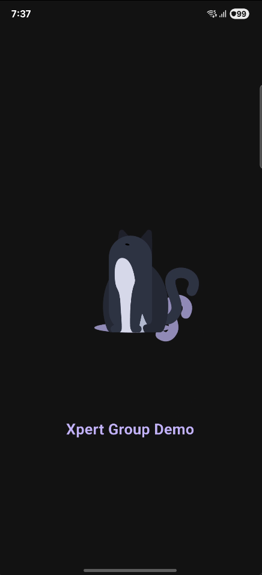

# xpert_group_demo

Aplicación de prueba para el cargo de Desarrollador FullStack Flutter y Java en XpertGroup.

## Capturas de pantalla

  

    
  

  

    
  

  

    
  

  

    
  

  

    
  

  

    
  

  

    
  

## Enlace a la apk

[Descargar apk](https://drive.google.com/file/d/1G6DTIy9XZzsvJ-f4j0KjWhp3oJlTpH37/view?usp=sharing)

## Características

- [x] Lista de razas de gatos
- [x] Votación de razas
- [x] WebView para ver la política de privacidad y la ayuda y soporte
- [x] Tema oscuro y claro
- [x] Caché de las razas de gatos
- [x] Caché de las imágenes de las razas de gatos
- [x] Caché de las imágenes de los votos

## Instalación

1. Clonar el repositorio
2. Ejecutar `flutter pub get`
3. Ejecutar `flutter run`

## Compilar Android para pruebas

1. Ejecutar `flutter build apk --target-platform android-arm,android-arm64,android-x64 --shrink`

## Licencia

[MIT](https://opensource.org/licenses/MIT)

## Autor

[Paul Osinga](https://github.com/paulpwo)